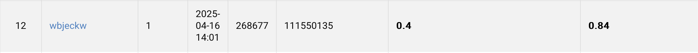

# NYCU Computer Vision 2025 Spring HW1

**StudentID:** 111550135 
**Name:** 林李奕

---

## Introduction

This is my implementation for NYCU Computer Vision Spring 2025 Homework 1.  
The goal of this assignment is to classify images into 100 categories using deep learning models.

In this project, I use the `resnest200e` model from [timm](https://github.com/huggingface/pytorch-image-models), combined with:

- **Data Augmentation**: `RandAugment`, `MixUp`, and `CutMix`
- **Training Tricks**: Cosine Annealing LR scheduler, label smoothing loss alternatives
- **Evaluation**: Accuracy plots, loss plots, and confusion matrix
- **Ensemble**: Multiple trained models with different augmentations to boost test performance

---

## How to install

1. Clone this repository:

    ```bash
    git clone https://github.com/owo0505/NYCU-Computer-Vision-2025-Spring.git
    cd NYCU-Computer-Vision-2025-Spring
    ```

2. Install dependencies (make sure you have Python ≥ 3.8):

    ```bash
    pip install -r requirements.txt
    ```

3. Prepare your dataset in this format:

    ```
    data/
    ├─ train/
    │   ├─ class0/
    │   ├─ class1/
    │   ├─ ...
    │   
    ├─ val/
    │   ├─ class0/
    │   ├─ class1/
    │   ├─ ...
    │
    └─ test/
        ├─ aaa.jpg
        ├─ bbb.jpg
        ├─ ...

    ```

4. Train the model:

    ```bash
    # Make sure data_dir in train.py is set to your actual dataset path
    python train.py
    ```

5. Run inference (after training completes and best models are saved):

    ```bash
    # Remember to change test_dir in inference.py to the actual test dataset path
    python inference.py
    ```

6. Convert predictions to string labels:

    ```bash
    python process.py
    ```

---

## Performance snapshot

| Model             | Validation Accuracy | Notes                                       |
|------------------|---------------------|---------------------------------------------|
| resnest200e       | ~93.7%              | Best single model (RandAugment, MixUp/CutMix) |
| Ensemble (3x200e) | ~94.0%              | Combined output from three trained models   |



You can find training curves and confusion matrix output under Result:

- `loss_curve.png`
- `accuracy_curve.png`
- `confusion_matrix.png`

---
